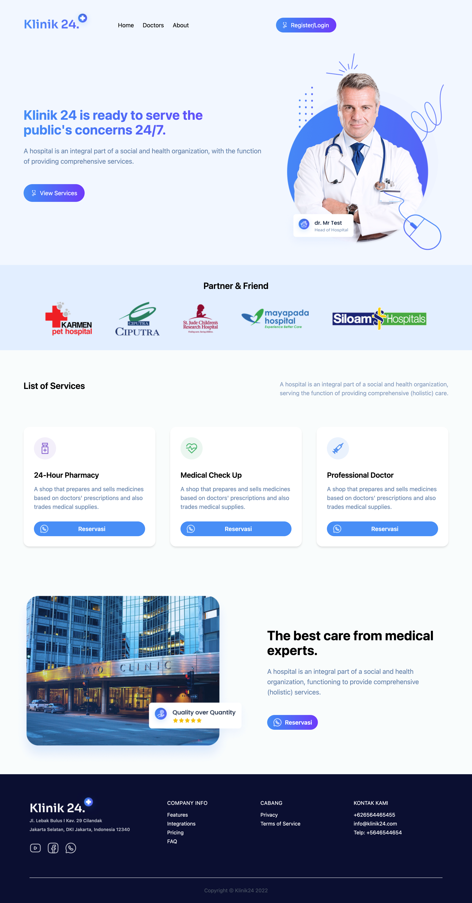

# 🏥 Klinic – Medical Website

A modern, responsive React website for clinics and healthcare professionals. Built with Tailwind CSS and GSAP for sleek animations and mobile-friendly design.

---

## 🔗 Live Site

🌐 [https://klinic-site.netlify.app](https://klinic-site.netlify.app)

---

## 📸 Preview




---

## 🚀 Features

- Responsive design for mobile, tablet, and desktop
- Animated navbar with hamburger menu on small screens
- GSAP-powered animations
- Register/Login CTA
- Simple and clean layout
- Built with:
  - **React**
  - **Tailwind CSS**
  - **GSAP**
  - **React Router**

---

## 🛠️ Installation & Development

```bash
# 1. Clone the repo
git clone https://github.com/pronoyNath/klinic-site.git
cd klinic-site

# 2. Install dependencies
npm install

# 3. Run the development server
npm run dev
